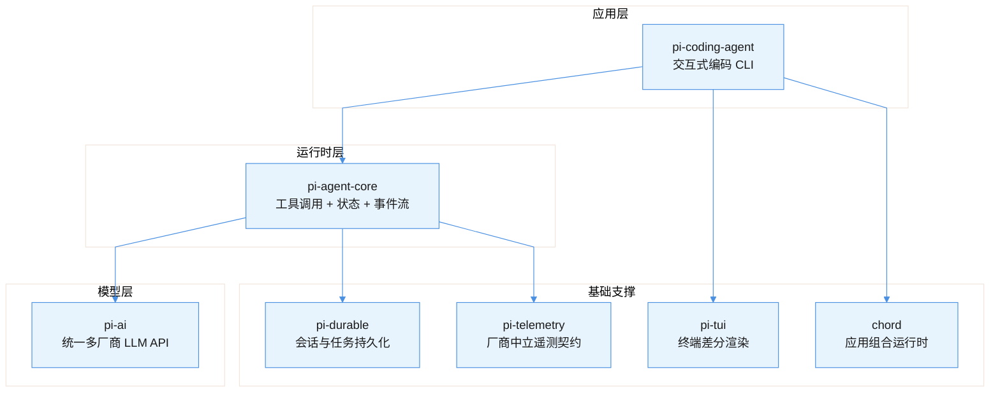
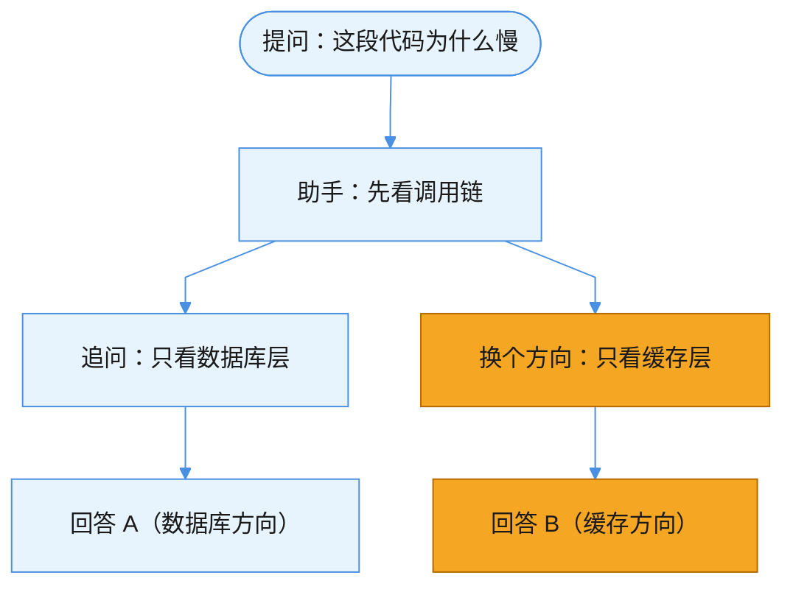
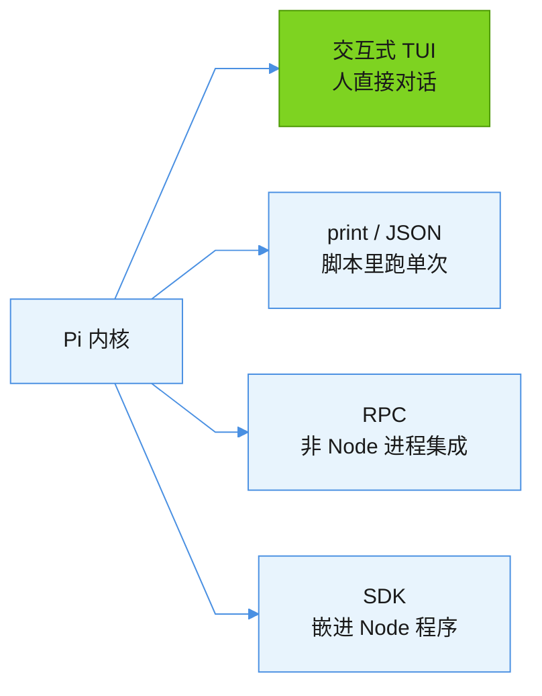
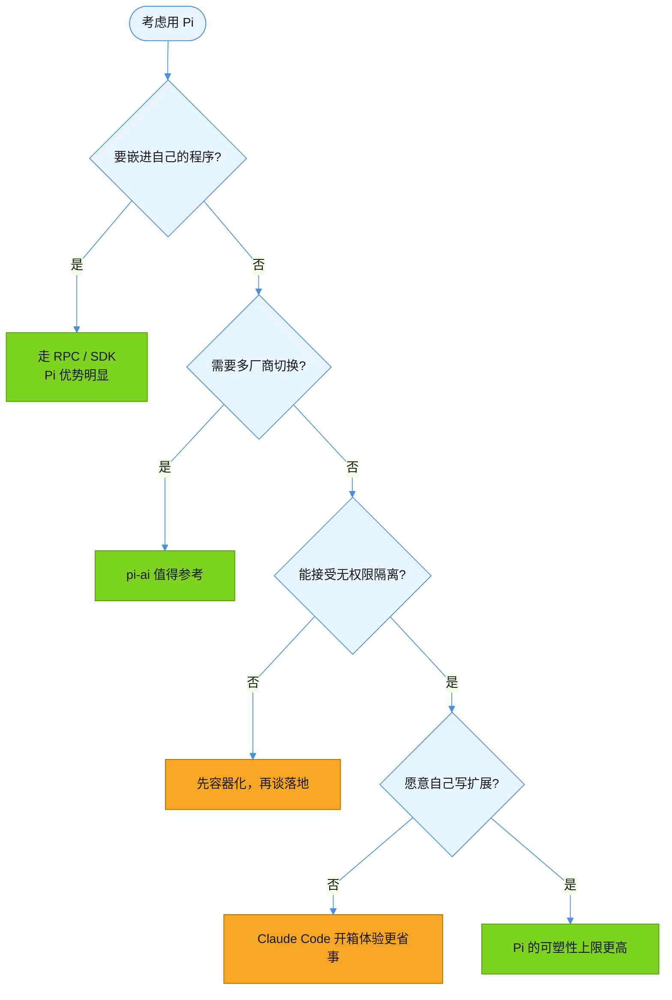

> 🤖 本文档由 AI 辅助生成
>
> 🧠 模型: DeepSeek-V4.1-Flash
>
> 👤 生成人: 魏威
>
> 🕐 生成时间: 2026-09-21 17:37:41

# Pi 编码 agent：最小内核哲学，以及与 Claude Code / Codex 的路线差异

> 适用版本：Pi v0.86.1（2026-09-20 发布），要求 Node.js ≥ 22.19.0；对比工具以 2026-09 现状为准。整理日期：2026-09-21。

## 结论

**Pi 是一个开源的终端编码 agent，和 Claude Code / Codex CLI 属于同一类工具，但走的是「最小内核 + 你自己扩展」的路线，而不是「开箱即用的全家桶」。**

由此推出三个最实用的判断：

- **它的默认能力刻意比 Claude Code 少**——默认只给模型 4 个工具，没有子代理、没有 plan mode、没有权限弹窗。这是设计立场，不是没做完；缺的能力用 TypeScript 扩展或第三方包补。
- **它的真正差异点在「可编程」**：`pi-ai` 把几十家模型厂商收在一个接口下，加上 RPC 与 SDK 两种集成方式，适合把 agent 嵌进自己的工具链；如果只是日常写代码，体感未必强过 Claude Code。
- **它的安全边界要单独算**：默认没有文件系统/进程/网络的权限隔离，跑的就是启动它的用户权限。评估时不能只比功能表，这一条足以决定它能不能进生产流程。

一句话概括取舍：**Pi 把「决定工作流长什么样」的权力交还给使用者，代价是使用者得自己动手。**

## 原理

### Pi 是什么

| 维度 | 值 |
|---|---|
| 定位 | 终端编码 agent harness（可编程的 agent 运行时） |
| 官网 | https://pi.dev |
| 仓库 | https://github.com/earendil-works/pi |
| 作者 | Earendil Works（Mario Zechner，libGDX 作者） |
| 开源协议 | MIT，全开源 |
| 实现语言 | TypeScript / Node.js（monorepo） |
| 安装 | `npm install -g --ignore-scripts @earendil-works/pi-coding-agent` |
| 运行要求 | Node.js ≥ 22.19.0 |

「harness」这个词是理解它的关键：Pi 不只是一份 CLI，而是「模型 + 工具 + 会话 + 扩展」这一整套骨架。CLI 只是这套骨架自带的一个外壳，你完全可以只取其中的运行时，嵌进自己的程序。

### 架构：一个拆成多层库的 monorepo

Pi 把 agent 拆成了职责清晰的几层，而不是塞进一个包：



读图重点：**换掉最上面一层就是另一个产品**。想要终端 CLI 就拿 `pi-coding-agent`；想嵌进自己的服务端程序，就直接用下面的 `pi-agent-core` + `pi-ai`，不必拖着 CLI。

几个包的实际用途：

| 包 | 作用 | 什么时候会直接用到 |
|---|---|---|
| `pi-coding-agent` | 交互式编码 agent CLI | 当工具用 |
| `pi-agent-core` | agent 运行时：工具调用、状态管理、事件流 | 自己写 agent 循环时 |
| `pi-ai` | 统一多厂商 LLM API 层 | 需要一套代码切多家模型时 |
| `pi-tui` | 终端 UI 库（差分渲染） | 做终端界面时 |
| `pi-durable` | 会话、任务、文档的持久化运行时 | 需要落盘/恢复会话时 |
| `chord` | 应用组合运行时（services / RPC / 插件） | 组装多进程应用时 |
| `pi-telemetry` | 厂商中立的 telemetry 契约 | 接自己的监控体系时 |

### 默认工具只有 4 个，但内置工具其实有 8 个

这里有个容易混淆的地方，值得单独说清：

- **默认启用 4 个**：`read`、`write`、`edit`、`bash`。这是开箱即用的状态，也是「最小内核」的体现。
- **内置共 8 个**：另有 `grep`、`find`、`ls`，以及 Windows 上的 `powershell`。这些不默认开，得显式启用。

```bash
pi --tools read,bash,edit,write,grep   # 白名单：只开这几个
pi --exclude-tools bash                # 黑名单：开默认的，但去掉 bash
pi --no-builtin-tools                  # 关掉全部内置工具，只保留扩展提供的
```

为什么默认只给 4 个？因为模型本来就会用 `bash` 去 `grep`、`ls`——多塞工具反而增加选择成本和 token 开销。这是刻意的减法，不是能力缺失。

### 会话即树：不是线性聊天记录

多数 agent 的会话是一条直线，Pi 把它存成**树**。每条记录带 `id` 和 `parentId`，会话文件是 JSONL：



从同一个点分叉出两条探索路径后，**两条都留在同一个文件里**，随时切回来对比——不用像线性会话那样，为了试另一个方向而丢掉前面已建立的上下文。这几个命令围绕这棵树工作：

| 命令 | 作用 |
|---|---|
| `/tree` | 在会话树里原地跳转，从任意历史点继续 |
| `/fork` | 从某条历史用户消息**另存为新会话** |
| `/clone` | 把当前分支**整条复制**成新会话 |
| `/compact` | 压缩上下文（长会话触顶时用） |
| `/share` | 上传成私有 gist，给出可分享的 HTML 链接 |

⚠️ 压缩是**有损**的：摘要会替换掉旧消息。完整历史仍在 JSONL 里，靠 `/tree` 回去翻。

### 四种运行模式

同一套内核，四种被使用的方式：



**RPC 模式是它区别于多数同类工具的能力**：用 stdin/stdout 传 JSONL，意味着 Python、Go、Java 写的程序都能把 Pi 当成一个可调用的子进程，而不必是 Node 项目。

### 扩展体系：补上被刻意省掉的能力

Pi 的立场是「内置功能少，扩展能力强」。四类资源都能打成一个包，用 npm 或 git 分发：

| 类型 | 形态 | 调用方式 |
|---|---|---|
| Extensions | TypeScript 模块 | 注册工具、命令、快捷键、事件处理、UI |
| Skills | `SKILL.md`（遵循 Agent Skills 标准） | `/skill:name` 或模型自动加载 |
| Prompt Templates | Markdown 文件 | `/模板名` 展开 |
| Themes | 主题文件 | 热重载，改完立即生效 |

用扩展能做到什么，官方 README 给了一张清单，包含：自定义工具（甚至可以替换内置工具）、子代理、plan mode、自定义压缩策略、权限门与路径保护、状态栏与页脚、Git 检查点自动提交、SSH 与沙箱执行、MCP 集成，以及「把 pi 长得像 Claude Code」。

> **这就是理解 Pi 的关键**：Claude Code 里那些「内置功能」，在 Pi 这里大多是「扩展示例」。官方甚至把 Doom 跑在扩展里当作能力演示。

⚠️ **安全提醒**：扩展执行任意代码，skill 能指示模型做任何操作。官方文档明确写着 Pi 包**拥有完整系统权限**，装第三方包前必须先读源码。

### 厂商中立：一套接口接几十家模型

`pi-ai` 层统一了各家 API，支持三类接入方式：

- **订阅制**：Anthropic Claude Pro/Max、OpenAI ChatGPT Plus/Pro (Codex)、GitHub Copilot
- **API Key**：Anthropic、OpenAI、Google Gemini/Vertex、DeepSeek、Mistral、Groq、xAI、OpenRouter、Kimi、MiniMax、小米 MiMo 等数十家
- **本地模型**：llama.cpp router server

```bash
pi --list-models                    # 列出可用模型
pi /model                           # 交互式切换（Ctrl+L）
pi --model anthropic/claude-sonnet-5  # 指定 provider/模型
```

**能中途跨厂商换模型**是它比较特别的一点：一个会话里从 A 家模型切到 B 家，上下文继续用。对做多模型对比、或按任务难度分配算力的场景很实用。

要接自建网关或公司内网代理，走 `~/.pi/agent/models.json` 注册自定义 provider（需是 OpenAI / Anthropic / Google 三种 API 之一）；协议更特殊的话，用扩展里的 `pi.registerProvider()`。

### 对比：Pi vs Claude Code vs Codex CLI

> 数据为 2026-09-21 实测拉取：GitHub API 取 stars/forks，npm registry API 取下载量。

| 维度 | **Pi** | Claude Code | Codex CLI |
|---|---|---|---|
| 背景 | 独立开发团队（libGDX 作者） | Anthropic | OpenAI |
| 开源 | ✅ MIT 全开源 | ❌ 仓库仅用于分发与反馈，核心闭源 | ⚠️ Apache-2.0 开源仓库 |
| 语言 | TypeScript | TypeScript | Rust |
| GitHub stars | ≈ 10.8 万 | ≈ 14.7 万 | ≈ 12.6 万 |
| 近 30 天 npm 下载 | ≈ 909 万 | ≈ 5920 万 | ≈ 7791 万 |
| 设计哲学 | 最小内核 + 自己扩展 | 能力全家桶、开箱即用 | 深度绑定 OpenAI 模型 |
| 默认工具 | 4 个 | 丰富 | 丰富 |
| 子代理 / plan mode | ❌ 刻意不做，靠扩展补 | ✅ 内置 | ✅ 内置 |
| 多模型 | ✅ 数十家 + 跨厂切换 | ⚠️ 主要面向 Anthropic | ⚠️ 主要面向 OpenAI |
| 集成方式 | TUI / print / RPC / SDK | CLI + IDE 插件 | CLI + IDE 插件 |
| 权限隔离 | ❌ 无内置，需自行容器化 | ✅ 有确认流程 | ✅ 有沙箱机制 |
| 企业背书 | 无 | Anthropic | OpenAI |

**关于下载量这张表怎么读**：npm 下载量会包含 CI 环境里的重复安装，不能等同于用户数，但作为量级参照是有效的。Pi 与其他两者差约一个数量级，同时它的 stars 已达 10.8 万——**stars 与下载量的反差说明：关注度很高，但真正替换掉日常工具的人还是少数**。

### 安全边界：这条要单独评估

官方 README 写得很直白：**Pi 不包含限制文件系统、进程、网络或凭据访问的内置权限系统，默认以启动它的用户和进程权限运行。**

它给了三条容器化路径：

| 方案 | 做法 | 适用 |
|---|---|---|
| Gondolin 扩展 | `pi` 与模型凭据留在宿主机，内置工具与 `!` 命令转发进 Linux 微 VM | 想保留宿主体验又要隔离 |
| Plain Docker | 整个 `pi` 进程跑在本地容器里 | 简单隔离 |
| OpenShell | 整个 `pi` 进程跑在策略受控沙箱中 | 需要策略管控 |

没有权限弹窗这件事，官方立场是「**要么容器化，要么用扩展自己实现确认流程**」——而不是「我们会帮你兜底」。**把它用在工作机上，这一条必须先有答案。**

### 「不要什么」清单

Pi 的「没有」是有意为之，每一条都给了替代路径：

| 官方说不做 | 理由 | 替代方案 |
|---|---|---|
| MCP | 用 CLI 工具 + README 就够了 | 写 skill，或自己做 MCP 扩展 |
| 子代理 | 实现方式太多，不该由内核定 | tmux 起多个 pi、自己写扩展、装第三方包 |
| 权限弹窗 | 应由使用环境决定边界 | 容器化，或扩展实现确认流程 |
| plan mode | 不该由内核规定怎么规划 | 把计划写进文件，或装包 |
| 内置 to-do | 「它们会干扰模型」 | 用 `TODO.md` 文件 |
| 后台 bash | 可观测性差 | 用 tmux |

这张表比功能表更能说明 Pi 的性格：**它默认不相信「一种正确用法」，把每个决策都推回给使用者。**

## 示例：怎么评估要不要上



判断的重点不在「它功能多不多」，而在**你的场景是否需要它的强项**：嵌入集成、多模型中立、可编程内核。这三条都用不上时，选它反而要额外付出容器化和写扩展的成本。

### 上手速查

```bash
# 安装（要求 Node.js >= 22.19.0）
npm install -g --ignore-scripts @earendil-works/pi-coding-agent
# 或 curl -fsSL https://pi.dev/install.sh | sh

# 认证：API key 或订阅登录
export ANTHROPIC_API_KEY=sk-ant-...
pi
pi /login          # 选订阅方式

# 查看与切换模型
pi --list-models
pi --model anthropic/claude-sonnet-5

# 非交互单次执行
pi -p "解释这个仓库的构建流程"
cat README.md | pi -p "总结这段文字"

# 会话管理
pi -c              # 继续最近会话
pi -r              # 浏览历史会话
pi --no-session    # 临时模式，不落盘
pi --fork <id>     # 从某会话分叉

# 包管理
pi install npm:@foo/pi-tools
pi list
pi update --all
```

## 常见误区

| 误区 | 真相 |
|---|---|
| Pi 是 Inflection AI 那个陪伴型聊天助手 | 同名不同物。那个是 pi.ai（个人助手，不执行任务）；这里是 pi.dev，开源的终端编码 agent |
| Pi 用 Rust 写的 | 不对。仓库主语言是 TypeScript，对比的 Codex CLI 才是 Rust |
| Pi 默认只有 4 个工具，所以能力弱 | 4 个是**默认启用**数，内置实际有 8 个；且能力上限由扩展决定，不能只看默认配置 |
| 不内置子代理 / plan mode 是因为没做 | 是刻意不做。官方立场是这些不该由内核规定，留给使用者按自己工作流实现 |
| 开源 = 用起来更安全 | 反了。Pi **没有内置权限隔离**，第三方扩展和包拥有完整系统权限，比有确认流程的工具更需要自行加边界 |
| stars 十万 = 已经取代 Claude Code | 下载量差约一个数量级。高关注度不等于高日常使用率，两者要分开看 |
| 接公司内网网关可以零配置 | 不一定。内置 provider 面向各厂商官方端点，自建/代理网关需在 `models.json` 注册自定义 provider |

## 官方参考

- [pi.dev](https://pi.dev)：项目官网，含演示与最新文档入口。
- [github.com/earendil-works/pi](https://github.com/earendil-works/pi)：主仓库，README 含架构、扩展体系与哲学声明。
- [packages/coding-agent](https://github.com/earendil-works/pi/tree/main/packages/coding-agent)：CLI 包文档，含命令、快捷键、会话与配置细节。
- [packages/ai](https://github.com/earendil-works/pi/tree/main/packages/ai)：`pi-ai` 多厂商 LLM 抽象层。
- [containerization.md](https://github.com/earendil-works/pi/blob/main/packages/coding-agent/docs/containerization.md)：三种沙箱方案的官方说明。
