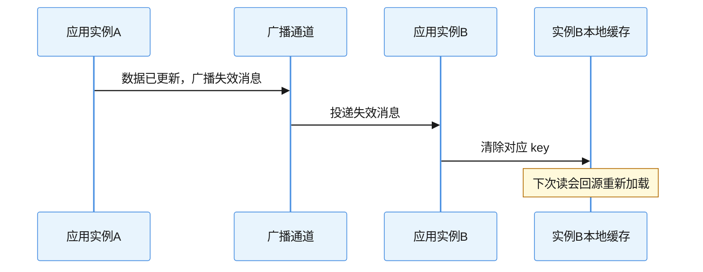
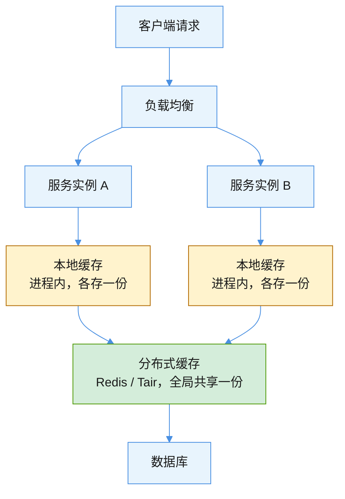
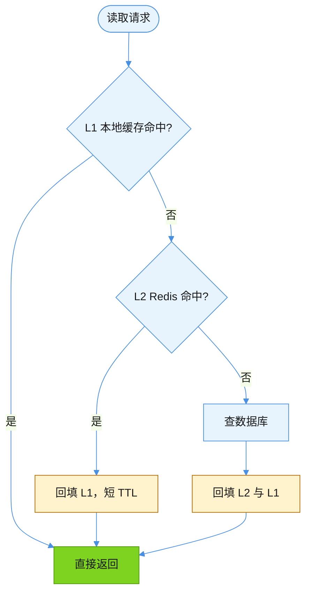

> 🤖 本文档由 AI 辅助生成
>
> 🧠 模型: DeepSeek-V4.1-Flash
>
> 👤 生成人: 魏威
>
> 🕐 生成时间: 2026-09-20 20:45:41

# 本地缓存与分布式缓存：从「存哪儿」到「怎么选」

> 适用版本：以 Spring Cache / Caffeine / Redis 现行实现为准；概念不依赖具体框架。整理日期：2026-09-20。

## 结论

**本地缓存是「每个进程自己存一份」，分布式缓存是「所有进程共用一份」。** 其余所有差异——快慢、一致性、容量、可用性——都是从这一条根上长出来的。

由此推出三个最实用的判断：

- 本地缓存快，但**多实例之间天然不一致**，这是它最大的坑，不是可以忽略的细节。
- 分布式缓存一致，但每次读都要付一次网络 RTT，并引入了一个新的可用性依赖。
- 两者不是二选一的对立关系，工程上常见的是**多级缓存**：本地做 L1、分布式做 L2，前提是失效机制跟上。

## 原理

### 本地缓存：进程内存里的一层

缓存数据直接放在**应用进程自己的内存里**（Java 侧即 JVM 堆内），读写就是一次内存访问，不走网络。

承载它的东西：`ConcurrentHashMap`、Caffeine、Guava Cache、Ehcache；Spring 的 `@Cacheable` 配上默认的 `ConcurrentMapCacheManager` 也是本地缓存。

| 维度 | 表现 |
|---|---|
| 访问速度 | 纳秒级，最快的一层 |
| 数据位置 | 每个实例各存一份，实例间互不可见 |
| 容量上限 | 受 JVM 堆限制，存多了直接推高 GC 压力 |
| 生命周期 | 进程重启即丢，冷启动要回源 |
| 一致性 | 多实例之间**天然不一致** |

```java
// Caffeine 典型用法：本地缓存要显式设容量上限和过期时间
Cache<String, DictItem> local = Caffeine.newBuilder()
        .maximumSize(10_000)                       // 必须有上界，否则撑爆堆
        .expireAfterWrite(Duration.ofSeconds(30))  // 短 TTL 兜底一致性
        .build();
```

这里两个参数都不是可选项。`maximumSize` 是防止缓存把自己变成 OOM 源；短 TTL 是给多实例不一致兜底——它的真正作用是「一旦失效通知丢了，脏数据最多存留 30 秒」。

### 本地缓存最难的地方：一致性

服务部署 8 个实例，你更新了数据，只有处理这次请求的那个实例知道，另外 7 个还在拿旧值。这个窗口有多长，取决于你怎么处理，通常有三条路：



| 做法 | 不一致窗口 | 代价 |
|---|---|---|
| 只设短 TTL，不广播 | 最长 = TTL | 实现最简单，但 TTL 越短回源越频繁 |
| TTL + 广播失效 | 毫秒级 | 需要一条广播通道（MQ / Redis pub/sub） |
| 只广播，不设 TTL | 依赖广播可靠性 | 消息一丢就永久脏，**不要这么干** |

广播通道推荐用 MQ 或 Redis 的 pub/sub。注意广播本身也可能丢消息或失败，所以最终形态永远是**广播 + 短 TTL 双保险**，而不是只靠其中一个。

### 分布式缓存：独立的一层服务

缓存数据放在**一个独立的外部服务**里，所有应用实例通过网络访问**同一份数据**。

承载它的东西：Redis、Tair、Memcached。

| 维度 | 表现 |
|---|---|
| 访问速度 | 百微秒级，比本地慢 1~2 个数量级（一次网络 RTT） |
| 数据位置 | 全局唯一一份，所有实例看到的一致视图 |
| 容量上限 | 可独立扩容，不受应用堆大小牵制 |
| 生命周期 | 与应用进程解耦，应用重启缓存还在 |
| 一致性 | 天然一致（都读同一份） |

代价是网络：每次读是一次 RTT，还叠加序列化/反序列化的 CPU 开销。更关键的是引入了**新的可用性依赖**——缓存集群抖动、或热点 key 打爆单个分片，会直接顶到业务上。所以用分布式缓存时，「缓存挂了怎么办」这个问题必须提前有答案，而不是等它挂了再想。

### 两者在链路中的位置



读图重点有两个：**本地缓存画在实例框内部**——它是进程的一部分，不是独立组件；**分布式缓存是所有实例汇合的那一层**——共享，且独立于应用生命周期。

### 对比总表

| 对比项 | 本地缓存 | 分布式缓存 |
|---|---|---|
| 数据归属 | 每实例一份 | 全局一份 |
| 访问耗时 | 纳秒级，无网络 | 百微秒级，含网络 + 序列化 |
| 一致性 | 实例间不一致，需广播失效 | 天然一致 |
| 容量 | 受 JVM 堆限制 | 可独立扩容 |
| 应用重启影响 | 缓存全丢，冷启动回源 | 不受影响 |
| 可用性风险 | 无外部依赖，最稳 | 引入缓存集群这个新依赖 |
| 典型场景 | 配置项、字典、热点小数据 | 会话、计数器、业务实体、大对象 |

## 示例：怎么选

按下面的顺序判断，基本能覆盖常见场景：

1. **数据量小 + 变更极少 + 读极频繁** → 本地缓存。枚举字典、开关配置、地区列表这类，放进程里最省事，几十 KB 数据拿 Caffeine 包一层，QPS 再高也不怕。
2. **需要跨实例一致 / 需要独立扩容 / 数据量偏大** → 分布式缓存。用户会话、库存计数、订单实体都属于这类。
3. **既要极快又要一致** → 多级缓存：L1 本地（TTL 秒级，故意设短）+ L2 Redis（TTL 长）。一致性靠「更新时广播失效 + 本地短 TTL 兜底」。

多级缓存的读路径大致是这样：



一句话经验：**本地缓存拿性能换一致性，分布式缓存拿网络开销换一致性。** 绝大多数业务接口的默认选择是分布式缓存；本地缓存只在「热点且容忍短暂不一致」时才上，而且要配失效机制。

### 缓存三大经典问题

这两个概念本身不解决下面三个问题，它们是上任何一层缓存都要面对的：

- **穿透**：查的是根本不存在的数据，缓存永远不命中，请求每次都落到数据库。对策是缓存空值或加布隆过滤器。
- **击穿**：某个热点 key 恰好过期，瞬间大量请求同时回源。对策是加互斥锁，只放一个请求去加载。
- **雪崩**：大批 key 同一时刻集体过期，或缓存集群整体挂掉。对策是过期时间加随机抖动 + 降级预案。

## 常见误区

| 误区 | 真相 |
|---|---|
| 本地缓存没有网络开销，所以全面优于分布式缓存 | 速度确实更快，但换来的是多实例不一致。变更频繁的数据放本地缓存，等于给自己埋脏数据 |
| 本地缓存设了过期时间就不会不一致 | TTL 只是把不一致窗口限制在 TTL 以内，并没有消除它。TTL 设 10 分钟就意味着最长 10 分钟的脏读 |
| 广播失效做得可靠，就不需要 TTL 了 | 广播本身也可能丢消息或消费失败。TTL 是兜底，不是冗余，两者要同时存在 |
| 分布式缓存天然一致，所以不会有并发问题 | 「读到的缓存值一致」不等于「并发更新安全」。多个实例同时回填、先删缓存后写库的时序问题依然存在 |
| 缓存只是加速手段，挂了顶多变慢 | 分布式缓存挂掉时，全部流量瞬时压到数据库，这才是真正的事故放大点，必须提前准备降级 |

## 速查卡

| 我要做什么 | 怎么做 |
|---|---|
| 判断该用哪层缓存 | 变更频率低 + 数据小 → 本地；需跨实例一致 → 分布式；两者都要 → 多级 |
| 本地缓存最小可用配置 | 必设 `maximumSize` + 短 `expireAfterWrite`，缺一不可 |
| 要保证多实例一致 | 广播失效（MQ / Redis pub/sub）+ 短 TTL 双保险 |
| 排查「改了数据但页面还是旧的」 | 先确认是单个实例脏还是全部脏：单个 → 本地缓存失效没广播到；全部 → 缓存或 DB 写路径问题 |
| 给缓存做降级 | 提前定义缓存不可用时的行为：限流、读 DB、还是返回兜底值 |

## 官方参考

- [Caffeine 官方文档](https://github.com/ben-manes/caffeine/wiki)：本地缓存的容量控制、过期策略与统计能力说明。
- [Spring Framework：Cache Abstraction](https://docs.spring.io/spring-framework/reference/integration/cache.html)：`@Cacheable` 抽象及各类 CacheManager 的适用场景。
- [Redis 官方文档](https://redis.io/docs/latest/)：分布式缓存的数据结构、过期机制与持久化行为。
- [Redis：Key eviction](https://redis.io/docs/latest/develop/reference/eviction/)：内存达到上限后的淘汰策略，分布式缓存容量规划的依据。