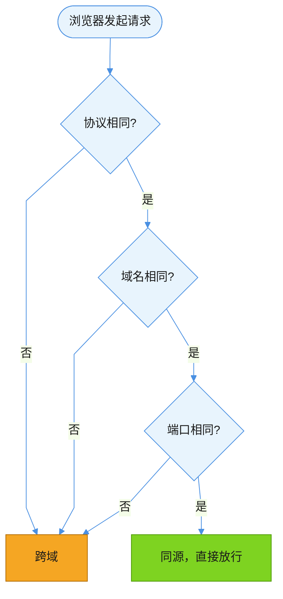
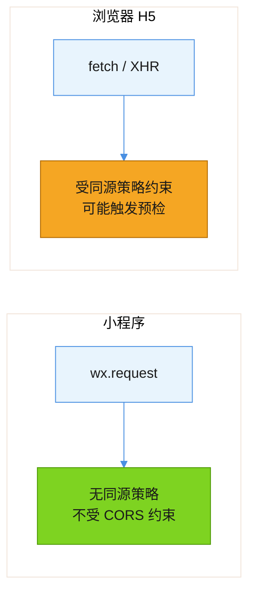
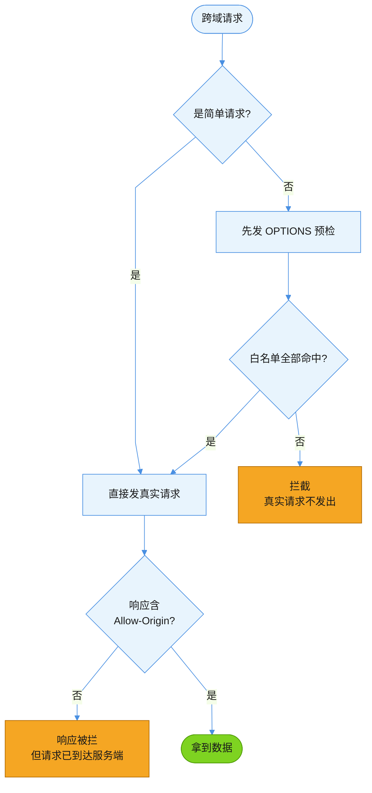
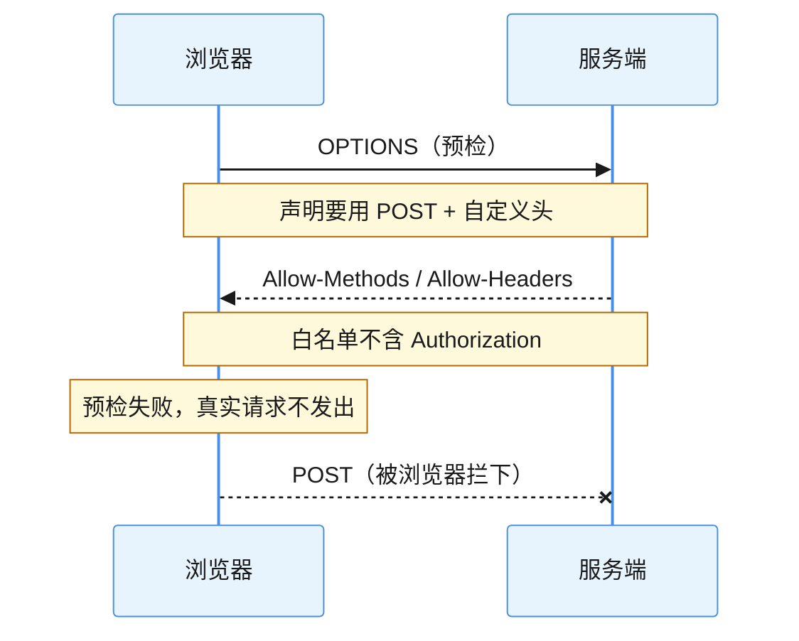
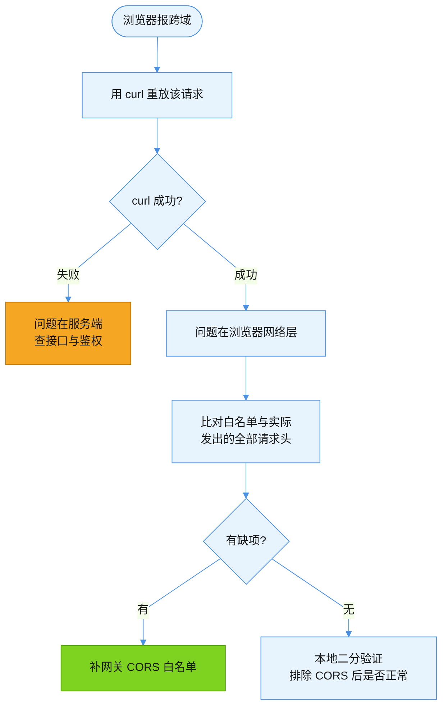

> 🤖 本文档由 AI 辅助生成
>
> 🧠 模型: DeepSeek-V4.1-Flash
>
> 👤 生成人: 魏威
>
> 🕐 生成时间: 2026-09-20 13:49:28

# CORS 跨域：从同源策略到 Network error 排查

> 适用版本：以 Fetch 标准与现行浏览器实现为准；概念同样适用于各类框架。整理日期：2026-09-20。

## 结论

**CORS 是浏览器的安全机制，不是服务端的限制。** 它决定的是“浏览器发起跨域请求后，能不能把响应交给页面脚本”，服务端该返回什么还返回什么。

由此推出三个最实用的判断：

- 用 `curl` 测通、浏览器报错，是完全正常且常见的组合——两者检查的东西根本不同。
- 报跨域不一定是接口坏了，很多时候只是响应头没配对。
- 报错时该不该去翻服务端日志，取决于失败发生在**预检**还是**响应**阶段，两者性质完全不同。

## 原理

### 同源策略

浏览器默认只允许页面脚本读取**同源**资源。同源 = 协议、域名、端口**三者全等**：



任何一项不同即跨域。注意 `https://a.com` 与 `http://a.com` 不同源，`https://a.com` 与 `https://a.com:8443` 也不同源。

**为什么要这样**：没有同源策略，你在浏览器里打开的任意恶意页面，都能悄悄读取你已登录的其他站点数据（带上你的 Cookie 发请求）。

### 谁受约束、谁不受

这是排查时最容易搞错的一点：



`curl`、Postman、服务端之间的调用、小程序的 `wx.request`，**都不走同源策略**。只有浏览器里的 `fetch`/`XHR` 受约束。所以“curl 测通、浏览器报错”是完全可能且常见的组合。

### 简单请求 vs 预检请求

浏览器把跨域请求分两类，处理路径不同：



**两个失败位置的差别很重要**：

- **预检失败（F）**：真实请求**根本没发出去**，服务端日志里什么都看不到
- **响应被拦（H）**：请求**已到达且可能已执行**（对写接口意味着数据已经改了），只是响应不给页面读

这个差别直接决定了你该不该去翻服务端日志：预检失败时翻日志是白费功夫，响应被拦时日志才是关键证据。

#### 什么算“简单请求”

同时满足以下全部：

| 条件 | 允许值 |
|---|---|
| 方法 | `GET` / `HEAD` / `POST` |
| Content-Type | `text/plain`、`multipart/form-data`、`application/x-www-form-urlencoded` |
| 自定义请求头 | 无（只能带 CORS 安全列表内的头） |

**只要有一条不满足，就触发预检。** 最常见的触发源：`Content-Type: application/json`（前后端分离项目的默认选项）。

### 关键响应头

预检时服务端要在响应里逐项“回答”：

| 响应头 | 作用 | 常见坑 |
|---|---|---|
| `Access-Control-Allow-Origin` | 允许哪些来源 | 用 `*` 时不能同时带 Cookie |
| `Access-Control-Allow-Methods` | 允许哪些方法 | 漏了 `OPTIONS` 本身 |
| `Access-Control-Allow-Headers` | 允许携带哪些自定义请求头 | 最常出问题的一个，见下 |
| `Access-Control-Allow-Credentials` | 是否允许带 Cookie | 为 `true` 时 Origin 不能用 `*` |
| `Access-Control-Max-Age` | 预检结果缓存多久 | 太短会导致频繁预检 |

#### `Allow-Headers` 为什么最容易踩

白名单是**逐字匹配**的，而且**大小写不敏感但必须列全**。典型翻车场景：



真实请求从未离开浏览器，所以**服务端日志里查不到任何记录**——这是判断“预检失败”的关键线索。

**特别注意**：除了你自己写的业务头，**SDK / 三方库可能自动附加认证头**（如 `Authorization`、`access-token`）。排查时不能只核对业务参数，要把实际发出的**全部**请求头拉出来比。

## 示例：排查 SOP



四条要点：

1. **先 curl 证伪服务端** —— 复用浏览器里的真实 token 和完整 header 重放。curl 成功就说明接口/鉴权/业务逻辑都没问题，排查范围直接收窄到“浏览器发请求”这一层，不用在服务端代码里瞎找
2. **重点看 `access-control-allow-headers`** —— 把实际请求携带的**所有**自定义头（含 SDK 自动加的）逐个核对是否在白名单里
3. **不要轻信“多端表现不一致 = 代码问题”** —— 先确认两端是否真的走同一段逻辑、同样的网络层
4. **善用 `--disable-web-security` 做二分验证** —— 排除 CORS 检查后问题消失，就反向坐实了根因

```bash
# 仅本地调试用！绝不能用于生产或分享给他人测试
open -na "Google Chrome" --args \
  --user-data-dir="/tmp/chrome-dev-cors" \
  --disable-web-security --disable-site-isolation-trials
```

### 实战案例：H5 报 Network error，小程序端正常

| 步骤 | 结果 |
|---|---|
| curl 复用真实 token 重放请求 | HTTP 200，返回正确业务数据 → **接口本身没问题** |
| 检查响应头白名单 | 只有 `token`，缺 `authorization` / `access-token` |
| 对比小程序抓包 | 只带 `token`（在白名单内），且小程序不受 CORS 约束 |

根因：第三方登录 SDK 发请求时额外带了 `Authorization` 和 `access-token` 两个头，而网关 `access-control-allow-headers` 白名单里没有它们 → 预检不通过 → 浏览器直接拦掉真实请求。

小程序端为什么没事？两个原因叠加：① `wx.request` 不受同源策略约束；② 它只带了白名单内的 `token`。

修复方式：网关 `access-control-allow-headers` 补上 `authorization`、`access-token`。这是唯一能救**生产环境真实用户**的方案——不可能让每个人都开 `--disable-web-security`。

## 常见误区

| 误区 | 真相 |
|---|---|
| CORS 报错 = 服务端接口坏了 | 不一定。接口可能完全正常，只是响应头没配对。用 curl 单独测能快速证伪 |
| 换个 `Referer` 能绕过 | 不能。CORS 校验的是 Origin 和 header 白名单，与 `Referer` 无关；浏览器也不允许脚本自定义 `Referer` |
| 装个“CORS 解除”插件就万能 | 不一定。插件靠篡改响应头实现，自身也可能有 bug（如“预检过了但真实请求被拦”）。且绝不能用于生产验证 |
| 小程序能跑、H5 报错 = 代码写错了 | 不一定。两端网络层机制不同（小程序无同源策略），逻辑可能完全一致 |
| 报错没看到服务端日志 = 服务端没收到 | 对预检失败而言确实如此，但**响应被拦**时请求是到达了的——要先分清是哪种失败 |

## 速查卡

| 我要做什么 | 怎么做 |
|---|---|
| 快速判断是不是 CORS 问题 | 用 curl 重放，成功 → 基本是 CORS |
| 确认预检失败还是响应被拦 | 预检失败：服务端无日志；响应被拦：有日志但页面读不到 |
| 查白名单差哪个头 | 浏览器 DevTools → Network → 该请求 → Request Headers 全量比对 |
| 临时本地绕过 | `--disable-web-security`（**仅调试**） |
| 正式修复 | 服务端补 `Access-Control-Allow-*` 响应头 |

## 官方参考

- [MDN：跨源资源共享（CORS）](https://developer.mozilla.org/zh-CN/docs/Web/HTTP/Guides/CORS)：CORS 机制、预检流程与各响应头的权威说明。
- [MDN：同源策略](https://developer.mozilla.org/zh-CN/docs/Web/Security/Same-origin_policy)：同源的判定规则，以及它保护的是什么。
- [MDN：Access-Control-Allow-Headers](https://developer.mozilla.org/zh-CN/docs/Web/HTTP/Reference/Headers/Access-Control-Allow-Headers)：白名单字段的匹配规则与通配符限制。
- [Fetch 标准](https://fetch.spec.whatwg.org/)：CORS 协议的规范定义，含简单请求与预检的判定条件。